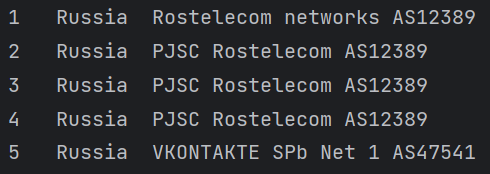

Задача: трассировка автономных систем

Релизован класс Trace. 

Конструктор принимает target (узел), и jumps - ограничение на количество автономных систем 

```python
def __init__(self, target :str, jumps=10)
```

Если jumps указать равным 0, то ограниения не будет.

Для запуска необходимо вызвать метод ```setup()``` у экземпляра класса Trace

\
***Пример:***\
Выходной результат для vk.com:

