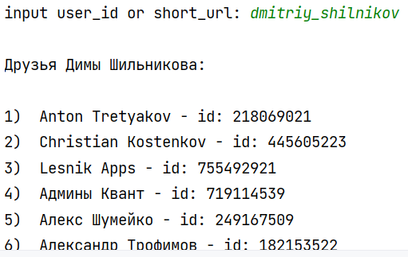

VK API

Шильников Дмитрий КН-203

Релизован класс VKApi, который принимает на вход **id** пользователя, 
друзей, которого мы хотим узнать и Ваш **вк-токен**.
***
Вместо id пользователя можно ввести и короткий адрес пользователя
***

```python
api = VKApi(name, vktoken)
```

После чего мы можем попросить вывести его друзей.

```python
api.print_friends()
```

пример работы:

